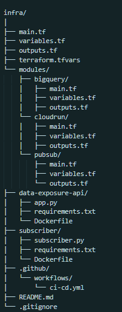
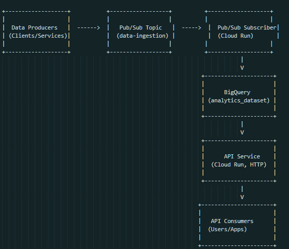

# Proyecto: Data Exposure Platform

Este proyecto es parte de un desafío técnico que involucra la creación de una plataforma para la ingesta y exposición de datos utilizando Google Cloud Platform (GCP). El objetivo es desarrollar una API que lea datos de BigQuery y los exponga a través de solicitudes HTTP GET, implementar un suscriptor que procese mensajes de Pub/Sub y escriba datos en BigQuery, y configurar un pipeline de CI/CD con GitHub Actions.

## Tabla de Contenidos

1. [Descripción General](#descripción-general)
2. [Arquitectura del Sistema](#arquitectura-del-sistema)
3. [Estructura del Proyecto](#estructura-del-proyecto)
4. [Prerequisitos](#prerequisitos)
5. [Configuración del Entorno](#configuración-del-entorno)
6. [Despliegue de Infraestructura](#despliegue-de-infraestructura)
7. [Despliegue de la API](#despliegue-de-la-api)
8. [Despliegue del Suscriptor](#despliegue-del-suscriptor)
9. [Uso](#uso)
10. [Pipeline de CI/CD](#pipeline-de-cicd)
11. [Pruebas](#pruebas)
12. [Monitoreo y Métricas](#monitoreo-y-métricas)
13. [Prácticas SRE](#prácticas-sre)
14. [Mejoras Futuras](#mejoras-futuras)
15. [Conclusión](#conclusión)

## Descripción General

El objetivo de este proyecto es crear una plataforma completa que permita:

- **Ingesta de Datos**: Procesar mensajes desde Pub/Sub y almacenarlos en BigQuery.
- **Exposición de Datos**: Desarrollar una API que lea datos desde BigQuery y los exponga a través de endpoints HTTP.
- **Automatización**: Configurar un pipeline de CI/CD que automatice el despliegue de la API y el suscriptor.
- **Monitoreo**: Implementar monitoreo y alertas para asegurar la disponibilidad y rendimiento del sistema.

## Arquitectura del Sistema

[Imagen de la arquitectura]

Componentes Clave:

- **Productores de Datos**: Aplicaciones o servicios que publican mensajes a un tema de Pub/Sub.
- **Google Cloud Pub/Sub**: Servicio de mensajería que actúa como cola de mensajes.
- **Suscriptor (Ingesta de Datos)**: Servicio desplegado en Cloud Run que escucha los mensajes de Pub/Sub y los inserta en BigQuery.
- **BigQuery**: Almacén de datos donde se guardan los datos procesados.
- **API HTTP**: Servicio desplegado en Cloud Run que expone los datos almacenados en BigQuery a través de endpoints HTTP.
- **Clientes**: Usuarios o aplicaciones que consumen los datos a través de la API.

## Estructura del Proyecto

# Data Exposure Platform

## Prerequisitos

- Google Cloud SDK instalado y configurado.
- Cuenta de Google Cloud Platform con permisos suficientes.
- Docker instalado en el sistema local.
- Terraform instalado para gestionar la infraestructura.
- Python 3.9 y virtualenv para el entorno de desarrollo.
- GitHub Account para gestionar el repositorio y configurar GitHub Actions.

## Configuración del Entorno

### 1. Clonar el Repositorio

    git clone https://github.com/tu-usuario/data-exposure-platform.git
    cd data-exposure-platform/

### 2. Configurar Variables de Entorno

Asegúrate de configurar las variables de entorno necesarias para la autenticación y configuración del proyecto.

    export GOOGLE_CLOUD_PROJECT="tu-proyecto"
    export GOOGLE_APPLICATION_CREDENTIALS="/ruta/a/tu/credencial.json"
    export GCP_REGION="us-central1"

### 3. Autenticarse con Google Cloud

    gcloud auth login
    gcloud config set project $GOOGLE_CLOUD_PROJECT

## Despliegue de Infraestructura

La infraestructura se gestiona con Terraform.

### 1. Inicializar Terraform

    cd infra/
    terraform init

### 2. Planificar los Cambios

    terraform plan -out=tfplan

### 3. Aplicar los Cambios

    terraform apply "tfplan"

Esto creará los recursos necesarios en GCP, incluyendo:
- Dataset y tablas en BigQuery.
- Tema y suscripción en Pub/Sub.
- Servicios de Cloud Run para la API y el suscriptor.
- Configuración de IAM para permisos adecuados.

## Despliegue de la API

### 1. Construir la Imagen Docker

    cd data-exposure-api/
    docker build -t gcr.io/$GOOGLE_CLOUD_PROJECT/data-exposure-api:latest .

### 2. Empujar la Imagen a Container Registry

    docker push gcr.io/$GOOGLE_CLOUD_PROJECT/data-exposure-api:latest

### 3. Desplegar a Cloud Run

    gcloud run deploy data-exposure-api \
      --image gcr.io/$GOOGLE_CLOUD_PROJECT/data-exposure-api:latest \
      --platform managed \
      --region $GCP_REGION \
      --allow-unauthenticated

## Despliegue del Suscriptor

### 1. Construir la Imagen Docker

    cd subscriber/
    docker build -t gcr.io/$GOOGLE_CLOUD_PROJECT/data-exposure-subscriber:latest .

### 2. Empujar la Imagen a Container Registry

    docker push gcr.io/$GOOGLE_CLOUD_PROJECT/data-exposure-subscriber:latest

### 3. Desplegar a Cloud Run

    gcloud run deploy data-exposure-subscriber \
      --image gcr.io/$GOOGLE_CLOUD_PROJECT/data-exposure-subscriber:latest \
      --platform managed \
      --region $GCP_REGION \
      --no-allow-unauthenticated \
      --service-account=tu-cuenta-de-servicio

## Uso

### Probando la API

1. Obtener la URL del servicio:

    gcloud run services describe data-exposure-api --region $GCP_REGION --format 'value(status.url)'

2. Probar el endpoint:

    curl https://<URL_DE_LA_API>/

Respuesta Esperada:

    {"message": "Bienvenido a la API de Exposición de Datos"}

### Publicando Mensajes a Pub/Sub

1. Enviar un mensaje de prueba:

    gcloud pubsub topics publish data-ingestion-topic --message='{"id": "1", "timestamp": "2024-04-27T12:00:00Z", "data": "Ejemplo de datos"}'

2. Verificar que los datos se hayan insertado en BigQuery:

    bq query --use_legacy_sql=false 'SELECT * FROM `tu-proyecto.analytics_dataset.analytics_table`'

## Pipeline de CI/CD

El pipeline de CI/CD está configurado con GitHub Actions y automatiza la construcción y despliegue de la API y el suscriptor.

### Visión General del Pipeline

#### CI:
- Se ejecuta en cada push a las ramas develop y master.
- Construye las imágenes Docker.
- Ejecuta pruebas unitarias y de integración.

#### CD:
- Si las pruebas pasan, empuja las imágenes a Container Registry.
- Despliega los servicios a Cloud Run.

### Cómo Desencadenar Despliegues

- **Despliegue a Desarrollo**: Hacer push a la rama develop.
- **Despliegue a Producción**: Hacer merge a la rama master.

## Pruebas

### Pruebas Unitarias

Las pruebas unitarias están ubicadas en los directorios tests/ de cada componente.

Ejecutar pruebas unitarias para la API:

    cd data-exposure-api/
    pytest tests/

### Pruebas de Integración

Las pruebas de integración verifican la interacción entre la API y BigQuery.

Ejecutar pruebas de integración:

    cd data-exposure-api/
    pytest integration_tests/

## Monitoreo y Métricas

### Métricas Propuestas

1. **Tiempo de Respuesta de la API (Latencia)**: Monitorea el tiempo que toma la API para responder a las solicitudes.
2. **Tasa de Error**: Rastrea el número de solicitudes fallidas o errores en el procesamiento.
3. **Tasa de Ingesta de Datos**: Monitorea el número de mensajes procesados por el suscriptor desde Pub/Sub a BigQuery.

### Herramientas de Monitoreo

**Google Cloud Monitoring**:
- Configurar dashboards personalizados para visualizar las métricas.
- Configurar alertas basadas en umbrales definidos.

## Prácticas SRE

### SLIs y SLOs

#### Indicadores de Nivel de Servicio (SLIs):
- Disponibilidad: Porcentaje de solicitudes exitosas a la API.
- Latencia: Tiempo de respuesta de la API.
- Actualidad de los Datos: Tiempo entre la ingesta y la disponibilidad de los datos.

#### Objetivos de Nivel de Servicio (SLOs):
- Disponibilidad: 99.9% de solicitudes exitosas.
- Latencia: 95% de las solicitudes deben tener una latencia menor a 300ms.
- Actualidad de los Datos: Los datos deben estar disponibles en la API dentro de 1 minuto después de la ingesta.

### Estrategias de Alertas

1. **Latencia Alta**: Alerta si el tiempo de respuesta promedio excede los 500ms en un periodo de 5 minutos.
2. **Alta Tasa de Errores**: Alerta si la tasa de errores supera el 1% del total de solicitudes.
3. **Retraso en la Ingesta de Datos**: Alerta si hay mensajes en Pub/Sub sin procesar por más de 2 minutos.

## Mejoras Futuras

1. **Implementar Caché**: Utilizar Cloud Memorystore para reducir lecturas a BigQuery y mejorar la latencia.
2. **Autoescalado Avanzado**: Configurar reglas de autoescalado basadas en métricas personalizadas.
3. **Gestión de Secretos**: Utilizar Google Secret Manager para manejar información sensible.
4. **Pruebas de Carga y Rendimiento**: Implementar pruebas con herramientas como Locust para validar el comportamiento bajo alta demanda.

## Conclusión

Este proyecto implementa una plataforma completa para la ingesta y exposición de datos en Google Cloud Platform, utilizando prácticas recomendadas de DevOps y SRE. A través de la automatización con Terraform y GitHub Actions, se logra un despliegue consistente y reproducible. El monitoreo y las alertas aseguran que el sistema mantenga altos niveles de disponibilidad y rendimiento.